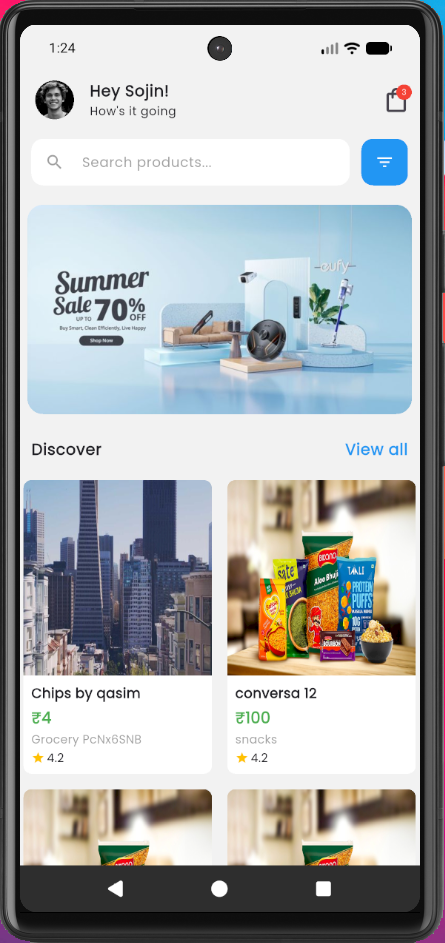
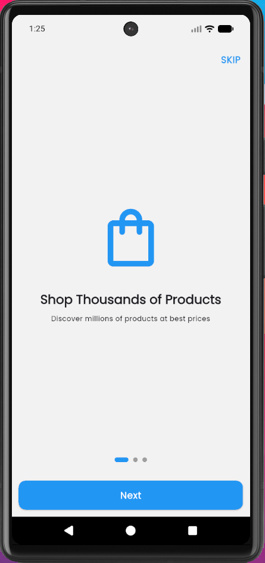
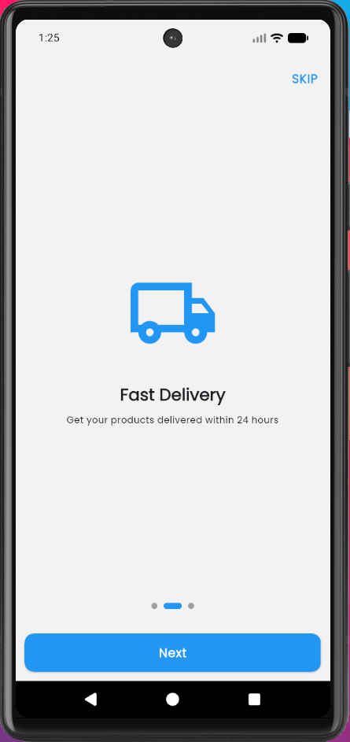

# Products App

A Flutter application that displays a product listing page using a public API. The app follows **Feature-first + Clean Architecture**, ensuring scalability, maintainability, and separation of concerns.

---

## 🚀 Features

* Product listing from API
* 2-column responsive grid (Flipkart-style)
* Adaptive UI (mobile & tablet)
* Displays:

  * Product image
  * Title
  * Price
  * Category
  * Rating
* Smooth UI animations using `flutter_animate`
* Error handling with `fpdart`
* Dependency injection using `get_it`

---

## 📸 Screenshots







---

## 🏗 Architecture

This project follows:

### Feature-first + Clean Architecture

```
lib/
 │
 ├── features/
 │    └── products/
 │         ├── data/
 │         │    ├── datasource/
 │         │    ├── models/
 │         │    └── repository/
 │         │
 │         ├── domain/
 │         │    ├── entity/
 │         │    ├── repository/
 │         │    └── usecase/
 │         │
 │         └── presentation/
 │              ├── pages/
 │              ├── widgets/
 │              └── state/
 │
 └── main.dart
```

---

## 📦 Packages Used

* **dio** → API calls
* **fpdart** → Functional error handling (`Either`)
* **get_it** → Dependency injection
* **flutter_animate** → UI animations

---

## 🌐 API

Base URL:

```
https://api.escuelajs.co/api/v1/products
```

---

## 🧠 State Management

Uses a clean and scalable approach using Bloc-style pattern.

Handles:

* Loading state
* Success state
* Error state

---

## 📱 UI Details

* GridView with 2 columns
* Card-based product UI
* Optimized spacing and scaling for tablets

---

## 🔄 Data Flow

```
UI → UseCase → Repository → DataSource → API
                                 ↓
                         Model → Entity
```

---

## ❗ Error Handling

* Network errors handled via `DioException`
* Wrapped using custom `AppError`
* Returned using `Either<AppError, Data>`

---

## 👤 Author

Sojin
Flutter Developer
